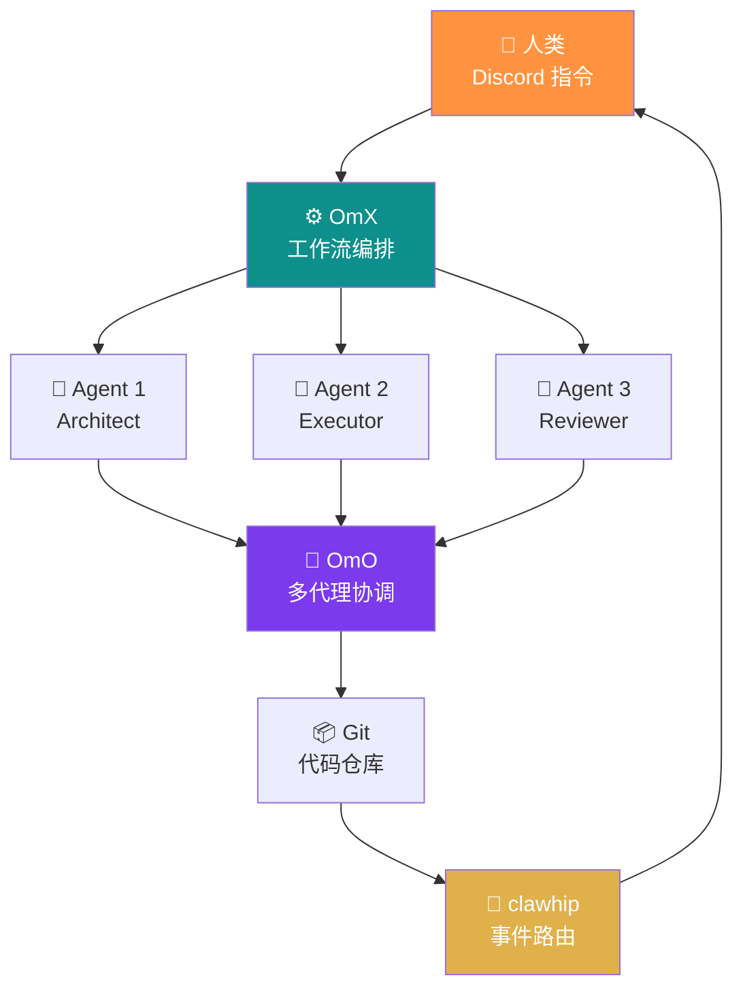
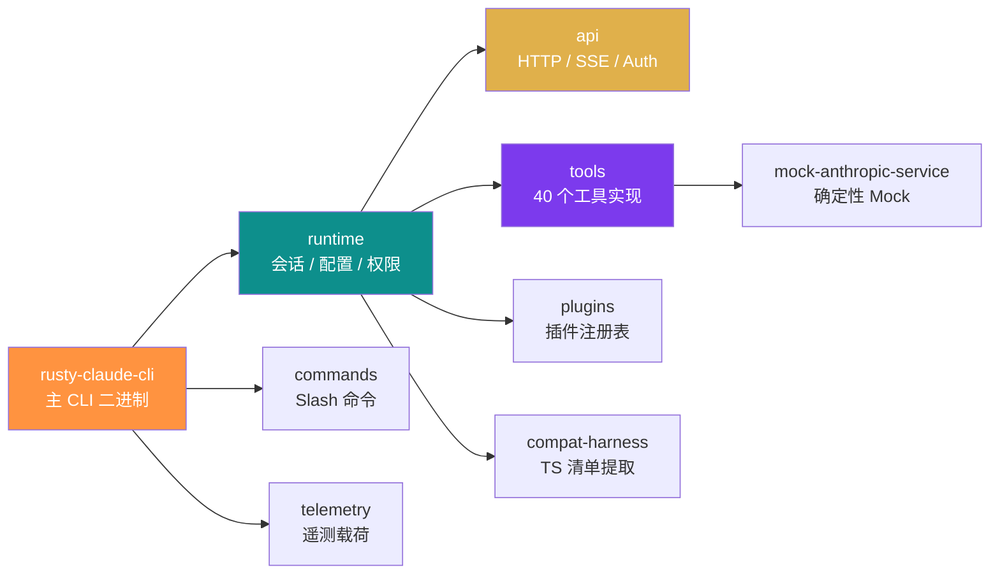
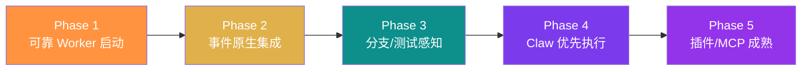

# Claw Code 深度解析：自主编码代理的开源 Harness 实现

Claw Code 是由 UltraWorkers 社区维护的开源编码代理 harness，其核心理念是用自主代理来构建自主代理——代码本身由 AI 代理协同编写、测试和部署。项目已从 TypeScript 移植到 Python，当前主力实现为 Rust，包含 9 个 crate、约 48,600 行 Rust 代码、40 个工具定义和完整的 mock 对齐测试体系。

> 人类定方向，Claw 做执行
>  - OmX (oh-my-codex) — 工作流编排与执行模式
>  - clawhip — 事件与通知路由器
>  - OmO (oh-my-openagent) — 多代理协调与冲突解决

## 项目总览

Claw Code 是 ultraworkers/claw-code 仓库的开源编码代理 harness。它最初以 TypeScript 编写，随后被移植为 Python，当前主力实现是 Rust。项目的独特之处在于：代码本身是由自主编码代理协同构建的。

### 背景与起源

由 Bellman / Yeachan Heo 和 Yeongyu 发起，项目通过 clawhip、oh-my-openagent、oh-my-claudecode、oh-my-codex 等自主编码工作流推进。仓库在发布 **2 小时内**即突破 **50K star**，成为 GitHub 历史上最快达到此里程碑的项目。

### 移植历程

TypeScript → Python (`src/`) → Rust (`rust/`)。当前 Rust 占比 **95.6%**，Python **4.4%**。Python 层保留了 port manifest 和 parity audit 查询引擎，用于跟踪移植进度。

### 仓库关键数据

| 指标 | 数值 |
|------|------|
| Commits on main | 292 |
| Rust crates | 9 |
| Rust LOC | 48,599 |
| Test LOC | 2,568 |
| 开发周期 | 2026-03-31 → 2026-04-03 (3天) |
| 贡献者 | 3 |

## 核心哲学

Claw Code 的核心观点是：当编码智能足够便宜且广泛可用时，稀缺资源不再是打字速度，而是架构清晰度、任务分解能力、判断力和产品品味。

### 人类接口是 Discord，不是终端

在 Claw Code 的工作流中，关键的人类接口不是 tmux、Vim 或 SSH，而是 **Discord 频道**。一个人可以在手机上输入一句指令，然后走开。Claw 读取指令，分解为任务，分配角色，编写代码，运行测试，在失败时争论，恢复，并在工作通过时推送。

> 设计哲学
> 人类的工作不是超越机器的编码速度。人类的工作是决定什么值得被构建。

### 瓶颈已经转移

当代理系统能在数小时内重建一个代码库时，稀缺资源变成了：

- 架构清晰度
- 任务分解能力
- 判断力与品味
- 关于什么值得构建的信念
- 知道哪些部分可以并行化、哪些必须保持约束

## 三层协作系统架构

Claw Code 的自主开发能力依赖三个相互独立但协同工作的系统层。每一层解决自主编码中的不同维度问题。

### OmX (oh-my-codex)

工作流层。将短指令转化为结构化执行：规划关键词、执行模式、持久验证循环、并行多代理工作流。提供 `$team` 模式（协调并行审查）和 `$ralph` 模式（持久执行 + 验证纪律）。

### clawhip

事件和通知路由器。监控 git commit、tmux session、GitHub issues/PR、代理生命周期事件和频道投递。**最重要的设计决策**：将通知路由从代理上下文窗口中剥离，让代理专注实现而不是格式化状态报告。

### OmO (oh-my-openagent)

多代理协调层。处理规划、任务交接、分歧解决和跨代理验证循环。当 Architect、Executor 和 Reviewer 意见不一致时，OmO 提供收敛结构而非发散。

## Rust Crate 工作区

当前 Rust 实现由 9 个 crate 组成，按职责清晰划分为 API 通信、运行时逻辑、CLI 交互、工具实现等层级。

### CLI 功能概览

- Anthropic API + Streaming ✅
- OAuth login/logout ✅
- Interactive REPL (rustyline) ✅
- Tool system (bash/read/write/edit/grep/glob) ✅
- Sub-agent orchestration ✅
- MCP server lifecycle ✅
- Session persistence + resume ✅
- Extended thinking (thinking blocks) ✅
- Cost tracking + usage display ✅

### 权限模式

CLI 支持三级权限模式，通过 `PermissionEnforcer` 在工具执行前进行守门检查：

1. **read-only** — 只允许读取操作，bash 中的写入命令被拒绝
2. **workspace-write** — 允许在工作区边界内写入文件
3. **danger-full-access** — 完全访问权限，默认模式

## 九车道对齐验证

项目使用 9 条并行开发车道来组织功能对齐工作。所有 9 条车道已合并到 main 分支。

| 车道 | 功能 | 状态 | 关键文件 |
|------|------|------|----------|
| 1 | Bash 验证 | ✅ merged | `bash_validation.rs` (+1004 LOC) |
| 2 | CI 修复 | ✅ merged | `sandbox.rs` (385 LOC) |
| 3 | File 工具 | ✅ merged | `file_ops.rs` (744 LOC) |
| 4 | TaskRegistry | ✅ merged | `task_registry.rs` (335 LOC) |
| 5 | Task 连接 | ✅ merged | `tools/src/lib.rs` |
| 6 | Team + Cron | ✅ merged | `team_cron_registry.rs` (363 LOC) |
| 7 | MCP 生命周期 | ✅ merged | `mcp_tool_bridge.rs` (406 LOC) |
| 8 | LSP 客户端 | ✅ merged | `lsp_client.rs` (438 LOC) |
| 9 | 权限执行 | ✅ merged | `permission_enforcer.rs` (340 LOC) |

### 安全防护

- **路径穿越防护** — 符号链接跟随和 `../` 逃逸检测
- **大小限制** — 读写操作的 MAX_READ_SIZE / MAX_WRITE_SIZE 约束
- **二进制检测** — NUL 字节检测阻止对二进制文件的文本操作
- **权限模式** — read-only 模式下拒绝所有写入和可变 bash 命令

## 演进路线

Claw Code 的目标是从「一个人类也能用的 CLI」演进为「Claw-native 执行运行时」。

### 产品原则

1. **状态机优先** — 每个 worker 有显式生命周期状态
2. **事件优于刮取** — 频道输出从类型化事件派生
3. **恢复先于升级** — 已知失败模式先自动修复一次
4. **分支新鲜度先于归责** — 检测陈旧分支后再判断是否为新回归
5. **终端是传输层不是真相源** — 编排状态必须在 tmux/TUI 之上

## 关键启示

从 Claw Code 仓库中可以提取出对企业级代理架构设计有价值的模式。

### 关注点分离

通知路由从代理上下文窗口分离（clawhip），工作流编排从代码执行分离（OmX），冲突解决从任务分配分离（OmO）。每一层只做一件事。

### 自举悖论

用代理来构建代理工具本身是一个自举实验。Claw Code 在 **3 天内**产出 **48,600 行** Rust 代码和 **292 个 commit**，验证了自主编码工作流在高速迭代场景中的可行性，同时也暴露了 CI 稳定性和文档一致性的挑战。

> 核心教训
> 代码是证据，协调系统才是产品。不要只盯着生成的文件——真正值得研究的是产生它们的系统。
